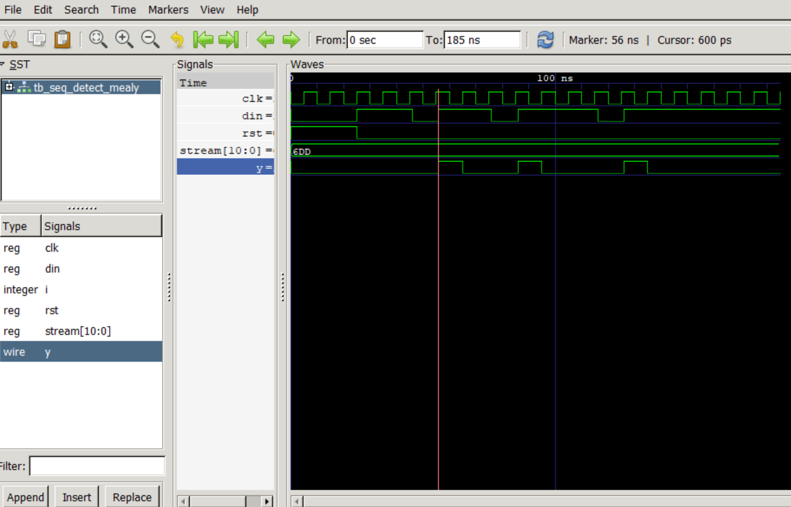

# Problem 1: Mealy Sequence Detector (1101)

## State Diagram
  
- **States**: `S0` (start or 0), `S1` (1), `S2` (11), `S3` (110).  
- **Transitions**: Labeled with `din/y` (e.g., `1/0` for `din=1` and `y=0`).  
- **Overlap Handling**: After detection, fall back to `S1` if next bit is `1`.

## Waveform
  
- **Signals**: `clk`, `rst`, `din`, `y`.  
- **Key Events**:  
  - Input: `11011011101` → `y=1` at cycles 4, 7, 11 .  

## Test Cases
| Input Stream  | Expected Pulse Indices (y=1) |
|---------------|------------------------------|
| `11011011101` | 4, 7, 11                     |
                        |

## How to Run
1. Compile & simulate:
   ```bash
   iverilog -o sim_p1 tb_seq_detect_mealy.v seq_detect_mealy.v
   vvp sim_p1
   gtkwave dump.vcd