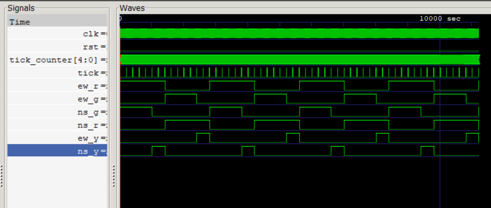

# Problem 2: Moore Traffic Light Controller

## State Diagram
  
- **States**:  
  - `NS_GREEN`: North-South green (5 ticks)  
  - `NS_YELLOW`: North-South yellow (2 ticks)  
  - `EW_GREEN`: East-West green (5 ticks)  
  - `EW_YELLOW`: East-West yellow (2 ticks)  
- **Transitions**: Triggered by `tick` after counting ticks in each state.

## Waveform
  
- **Signals**:  
  - `clk`, `rst`, `tick`  
  - `ns_g`, `ns_y`, `ns_r` (North-South lights)  
  - `ew_g`, `ew_y`, `ew_r` (East-West lights)  
- **Annotations**:  
  - Highlight 5-tick green phases and 2-tick yellow phases.  
  - Mark state transitions (e.g., `NS_GREEN → NS_YELLOW` at tick 5).  

## Test Cases
| Scenario          | Expected Behavior                          |
|-------------------|-------------------------------------------|
| Reset             | Starts in `NS_GREEN`                      |
| Normal Operation  | Cycles through states every 5/2/5/2 ticks |

## How to Run
1. Compile & simulate:
   ```bash
   iverilog -o sim_p2 tb_traffic_light.v traffic_light.v
   vvp sim_p2
   gtkwave dump.vcd
   Open dump.vcd in GTKWave to verify timing.

# Tick Generation
 - Simulation: tick pulses every 20 clock cycles (fast simulation).

 -  Hardware: Use tick_prescaler to generate 1 Hz from 50 MHz clock.

 - Verification: Confirm tick pulses align with state transitions.
 
---


### **Waveform Requirements**
1. **GTKWave Setup**:  
   - Add all signals (`clk`, `rst`, `tick`, light outputs).  
   - Group signals by road (`ns_*`, `ew_*`).  

2. **Annotations**:  
   - Mark `tick` pulses and state changes.  
   - Verify durations:  
     - `ns_g` high for 5 ticks → `ns_y` high for 2 ticks → etc.  

---

### **Example Testbench Notes**
- **Tick Simulation**:  
  ```verilog
  // In tb_traffic_light.v
  assign tick = (tick_counter == 19); // 1 pulse every 20 cycles (fast sim)