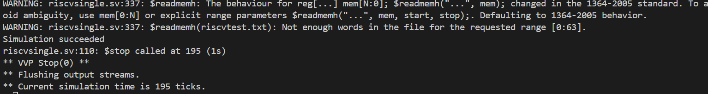

# Project Overview
This project implements the **RVX10 instruction set extension** – 10 new single-cycle instructions added to a base RV32I RISC-V core. The extension uses the reserved custom opcode space (`0x0B`) to maintain compatibility with the standard RV32I ISA.

---

## Implementation Details

### New Instructions Implemented
- **ANDN** - Bitwise AND with inverted second operand  
- **ORN** - Bitwise OR with inverted second operand  
- **XNOR** - Bitwise exclusive NOR  
- **MIN** - Signed minimum  
- **MAX** - Signed maximum  
- **MINU** - Unsigned minimum  
- **MAXU** - Unsigned maximum  
- **ROL** - Rotate left  
- **ROR** - Rotate right  
- **ABS** - Absolute value  

### Key Features
- Single-cycle execution for all new instructions  
- No architectural state changes beyond registers  
- Maintains full RV32I compatibility  
- Uses existing datapath components only  

---

## Project Structure
docs/
├── ENCODINGS.md # Instruction encoding details
├── TESTPLAN.md # Test strategy and cases
src/
├── riscvsingle.sv # Modified RV32I core with RVX10
├── riscvtest.s # Assembly test program
├── riscvtest.txt # Compiled test hex file
├── rvx10/ # RVX10 specific files
Makefile
sim_succeed.png
README.md 

---

## Building and Running with Icarus Verilog

### Prerequisites
- **Icarus Verilog (`iverilog` / `vvp`)**
- **Ubuntu/Debian:**  
  ```bash
  sudo apt-get install iverilog
macOS (Homebrew):


brew install icarus-verilog
Windows: Install from the official site or MSYS2

Quick Start
Compile and run the simulation:


iverilog -g2012 -o rvx10 src/riscvsingle.sv
vvp rvx10
Expected successful output:


Simulation succeeded
riscvsingle.sv:110: $stop called at 195 (1s)
** VVP Stop(@) **
** Flushing output streams.
** Current simulation time is 195 ticks.
Makefile Usage

make            # build + run
make compile    # only compile
make simulate   # only run simulation
make clean      # remove generated files
Verification
The testbench validates all 10 RVX10 instructions and reports success by storing the value 25 to memory address 100.

Success Indicator
A successful simulation displays:



The screenshot confirms all RVX10 instructions passed verification with Icarus Verilog.

Implementation Notes
Rotation handling: ROL/ROR with shift amount 0 correctly return the original value

ABS overflow: ABS(0x80000000) correctly returns 0x80000000 (two's complement wrap)

Register x0: Writes to x0 are properly ignored

Decode logic: Added custom opcode 0x0B detection with funct7/funct3 decoding

File Descriptions
src/riscvsingle.sv - Main RISC-V processor with RVX10 extensions

src/riscvtest.txt - Test program in hex format for $readmemh

docs/ENCODINGS.md - Complete instruction encoding specifications

docs/TESTPLAN.md - Detailed test cases and expected results

Troubleshooting
Common Warnings
You may see these warnings, which are normal:


WARNING: riscvsingle.sv:337: $readmemh(riscvtest.txt): Not enough words in the file for the requested range [0:63].
This indicates the test program is smaller than the memory array – this is expected behavior.


